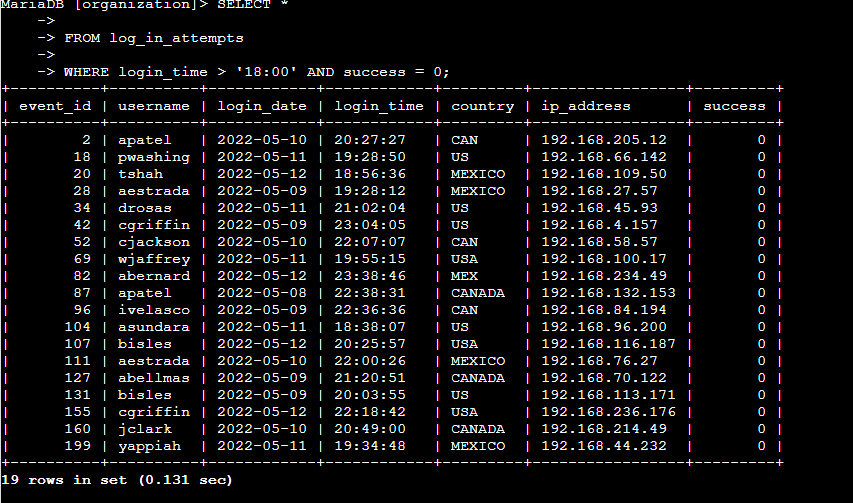
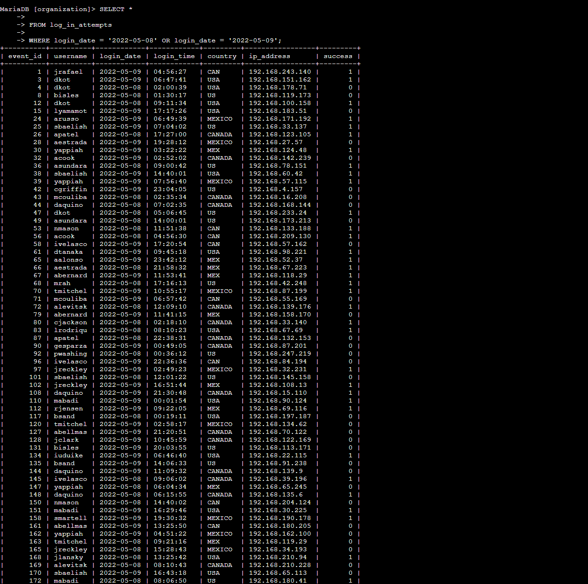
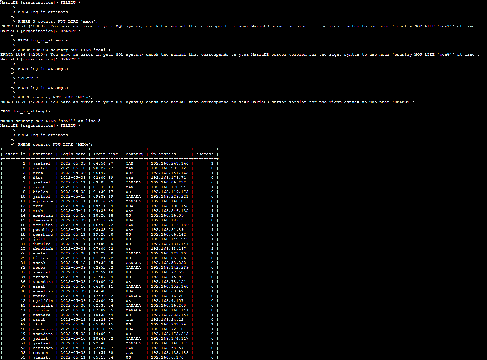
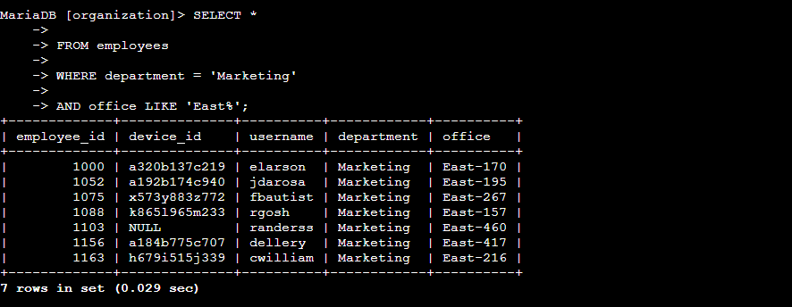
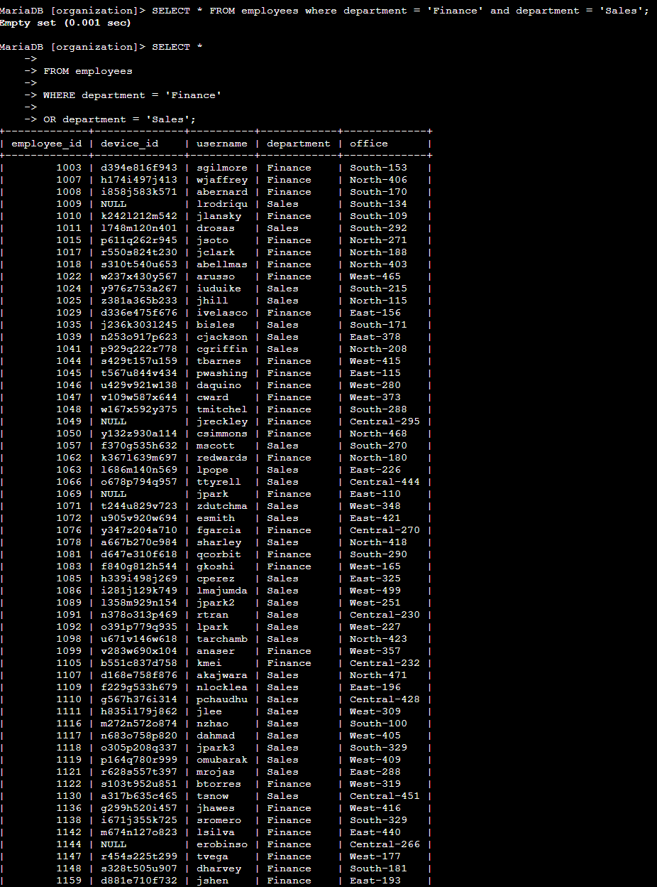
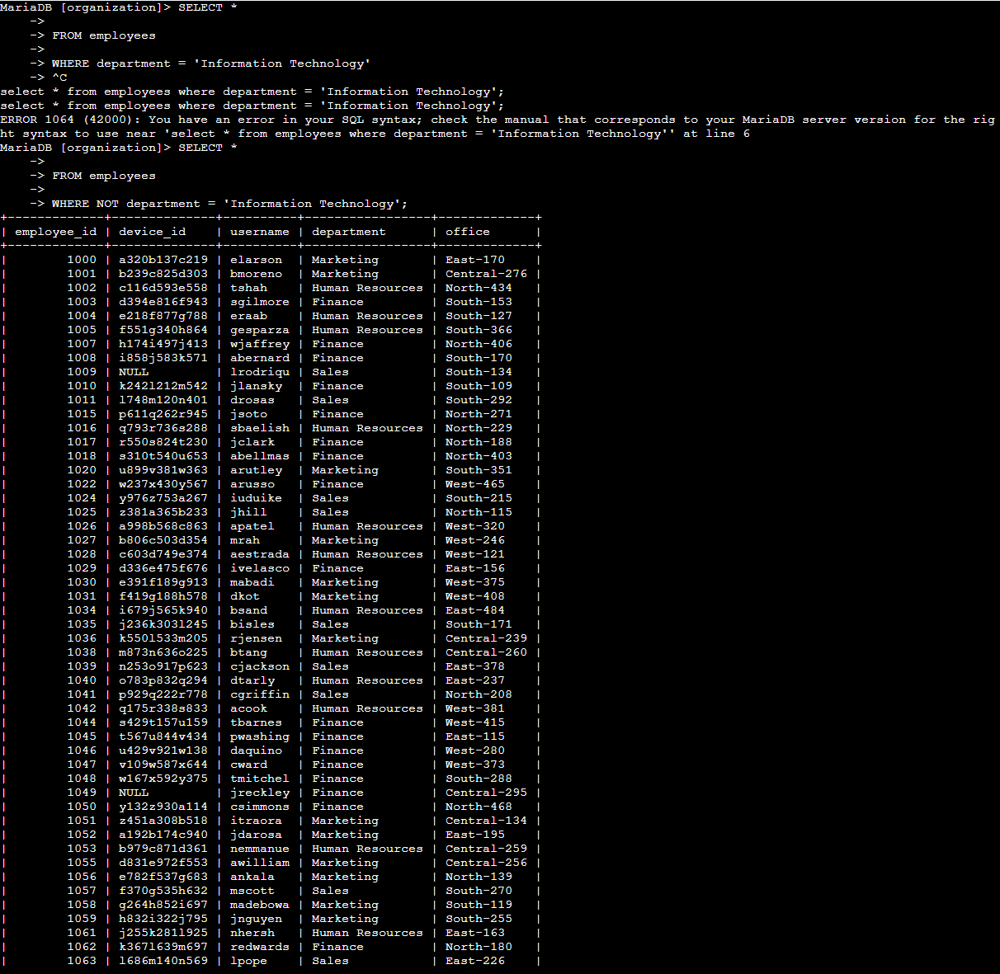

# SQL Security Investigation: Applying Filters to SQL Queries

## Project Overview

In this project, I used SQL to investigate potential security issues involving employee login activity and company devices. I queried and filtered data from the `log_in_attempts` and `employees` tables to identify suspicious login activity and determine which employee machines required security updates.

The investigation required me to use SQL operators including `AND`, `OR`, `NOT`, and `LIKE`, along with date and time filters. I also encountered several query errors during the investigation, diagnosed what was wrong with my logic or syntax, and corrected the queries to return the required results.

## Skills Demonstrated

- SQL database querying
- Security log analysis
- `SELECT` and `WHERE` statements
- `AND`, `OR`, and `NOT` operators
- Pattern matching with `LIKE` and `%`
- Date and time filtering
- Troubleshooting SQL syntax
- Correcting filtering logic
- Identifying systems requiring security updates

---

## 1. Retrieve After-Hours Failed Login Attempts

### Security Objective

I investigated failed login attempts that occurred after normal business hours. The goal was to identify unsuccessful login attempts after 6:00 PM that could require further investigation.

### SQL Query

```sql
SELECT *
FROM log_in_attempts
WHERE login_time > '18:00'
AND success = 0;
```

### Analysis

I filtered the `log_in_attempts` table using two conditions. The condition `login_time > '18:00'` limits the results to login attempts occurring after 6:00 PM, while `success = 0` identifies unsuccessful attempts.

I used the `AND` operator because both conditions had to be true for a record to be relevant. The query returned **19 failed after-hours login attempts**.

### Evidence



---

## 2. Retrieve Login Attempts on Specific Dates

### Security Objective

A suspicious event occurred on May 9, 2022. I reviewed login activity from both May 8 and May 9 to examine activity surrounding the event.

### SQL Query

```sql
SELECT *
FROM log_in_attempts
WHERE login_date = '2022-05-08'
OR login_date = '2022-05-09';
```

### Analysis

I used the `WHERE` clause to filter the `login_date` column for the two dates being investigated.

The `OR` operator was necessary because a login record could have occurred on either May 8 or May 9. A single record cannot have both dates simultaneously. The query returned **75 login attempts** from the two-day investigation period.

### Evidence



---

## 3. Retrieve Login Attempts Outside of Mexico

### Security Objective

The security team determined that the suspicious activity did not originate in Mexico. I needed to exclude login attempts originating from Mexico so the remaining activity could be investigated.

### SQL Query

```sql
SELECT *
FROM log_in_attempts
WHERE country NOT LIKE 'MEX%';
```

### Analysis

The `country` column contains more than one representation for Mexico, including `MEX` and `MEXICO`. Instead of filtering each value separately, I used `LIKE` with the `%` wildcard.

The pattern `'MEX%'` matches values beginning with `MEX`. Adding `NOT` excludes those records from the results. The corrected query returned **144 login attempts outside of Mexico**.

### Troubleshooting

This task also gave me useful experience troubleshooting SQL syntax. My initial attempts placed words in the wrong order around the `country` column and `NOT LIKE`, which caused MariaDB syntax errors.

I reviewed the structure of the `WHERE` clause and corrected the condition to:

```sql
WHERE country NOT LIKE 'MEX%';
```

This reinforced that SQL operators must be placed in the correct syntactical relationship to the column being evaluated.

### Evidence



---

## 4. Retrieve Marketing Employees in the East Building

### Security Objective

The organization needed to perform security updates on machines belonging to Marketing employees located in the East building.

### SQL Query

```sql
SELECT *
FROM employees
WHERE department = 'Marketing'
AND office LIKE 'East%';
```

### Analysis

I filtered the `employees` table using the `department` and `office` columns.

The condition `department = 'Marketing'` identifies Marketing employees. Because individual East building offices have values such as `East-170`, `East-195`, and `East-267`, I used `LIKE 'East%'` to match any office beginning with `East`.

The `AND` operator requires employees to satisfy both conditions. The query returned **7 Marketing employees located in the East building**.

### Evidence



---

## 5. Retrieve Employees in Finance or Sales

### Security Objective

A separate security update needed to be applied to machines belonging to employees in either the Finance or Sales departments.

### SQL Query

```sql
SELECT *
FROM employees
WHERE department = 'Finance'
OR department = 'Sales';
```

### Analysis

I used the `OR` operator because an employee could belong to either Finance or Sales and still need the update. The corrected query returned **71 employees** across the two departments.

### Troubleshooting

My first attempt used:

```sql
WHERE department = 'Finance'
AND department = 'Sales';
```

That query returned an **empty set**.

The syntax itself was valid, but the filtering logic was incorrect. Using `AND` required the same employee record to have a department value of both `Finance` and `Sales` simultaneously.

I recognized that the requirement was to retrieve employees belonging to **either** department, so I changed `AND` to `OR`.

```sql
WHERE department = 'Finance'
OR department = 'Sales';
```

This was an important distinction between a syntax error and a logic error: SQL can successfully execute a query even when the conditions do not represent what the analyst intended to investigate.

### Evidence



---

## 6. Retrieve All Employees Not in Information Technology

### Security Objective

Employees in the Information Technology department had already received a security update. I needed to identify employees in every other department whose machines still required the update.

### SQL Query

```sql
SELECT *
FROM employees
WHERE NOT department = 'Information Technology';
```

### Analysis

I used the `NOT` operator to exclude employees whose department was `Information Technology`. This allowed me to retrieve the employees who still needed the security update.

The query returned **161 employees outside of the Information Technology department**.

### Troubleshooting

During this task, I initially entered a query for the Information Technology department and then accidentally continued entering another SQL statement before properly completing the previous input. MariaDB returned a syntax error.

I corrected the statement and then applied the required `NOT` condition:

```sql
WHERE NOT department = 'Information Technology';
```

The corrected query successfully excluded the Information Technology department.

### Evidence



---

## Key SQL Concepts Applied

### AND

`AND` requires multiple conditions to be true simultaneously. I used it when identifying failed logins after 6:00 PM and Marketing employees located in the East building.

### OR

`OR` returns records when either condition is true. I used it to investigate two different login dates and to retrieve employees from either Finance or Sales.

### NOT

`NOT` excludes records matching a specified condition. I used it to exclude Mexico login activity and employees in the Information Technology department.

### LIKE and the % Wildcard

`LIKE` allows pattern matching instead of requiring an exact value. The `%` wildcard represents any sequence of characters.

For example:

```sql
country NOT LIKE 'MEX%'
```

excludes values beginning with `MEX`, including `MEX` and `MEXICO`.

Likewise:

```sql
office LIKE 'East%'
```

matches East building office values such as `East-170`, `East-195`, and `East-267`.

---

## What I Learned

One of the most useful lessons from this project was that a query can fail for different reasons. Some of my attempts produced **syntax errors**, while another query executed successfully but returned an empty set because my filtering logic was wrong.

Troubleshooting those results required me to read the database response, reconsider what the query was actually asking the database to do, and modify the statement accordingly. That process is directly relevant to security analysis because investigating logs requires more than writing a valid query—the query also has to accurately represent the question being investigated.

## Summary

This investigation demonstrated how SQL filtering can support cybersecurity investigations and vulnerability remediation. I used login records to investigate failed after-hours activity, activity surrounding a specific date, and logins originating outside a specified country. I also queried employee records to identify systems requiring security updates based on department and office location.

The project strengthened my ability to use `AND`, `OR`, `NOT`, `LIKE`, wildcards, and date/time filters while also giving me hands-on experience identifying and correcting both SQL syntax and logic errors.
